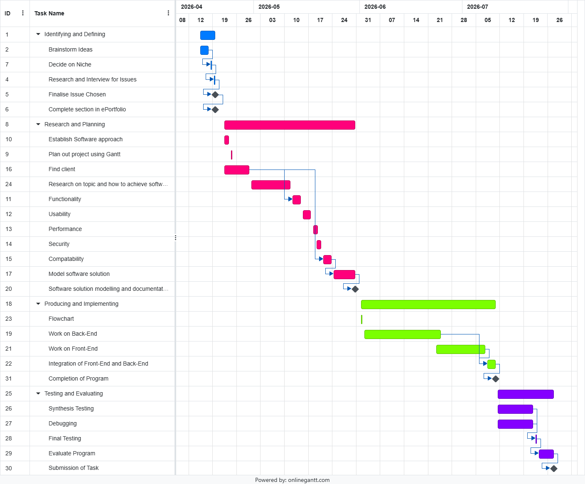

# Starting Point:

1. Gantt chart containing major tasks, the dependencies between them, and when they should take place. 
Milestones should also be included on the Gantt chart.

2. What software development approach (Waterfall/Agile/Wagile) will you be using and why.

I will be utilising the Agile software approach in the completion of this project. Why:

* Ability to adjust timeline. The agile framework will allow me to adjust how much time and progress I make depending on my schedule with school
* This allows me to work on parts/functions in the code throughout the duration of the task and makes it such that I do not have to follow a strict order allowing for better motivation as well as better quality of product
* The agile structure will also allow me to recieve feedback from my client more frequently

3. Discuss AT LEAST TWO social and/or ethical issues relevant to your project. (See Set 17.04)

Ethical Issues
* Ensure that any code or inspiration utilised is properly cited and credits are given
* Ensure that an accessible and useable UI is utilised. (DO not use manipulative UI)
* Ensure that web is secure enough to prevent XSS and phishing attacks

Social Issues
* Ensure that all major browsers are accounted for and have ability to access the app
* Ensure that sturdy security is established to maintain data security and gain user trust

4. Communication is very important in project work, and even more so in the distance education environment. Discuss how you plan to maintain appropriate communication with stakeholders (e.g. client, teacher) as you work on this project. (see course work Set 17.06)

5. Define functional and performance requirements by creating a Quality Assurance Checklist, using the template supplied in Set 17.07.

6. Data dictionary describing the data structures and variables used. (See 17.08)

7. Use a modelling tool to represent your software system and explain why that tool is appropriate in this case.
    - Data Flow Diagram (Level 1)
    - Structure Chart
    - Class Diagram
    - Storyboard
    - Decision Tree