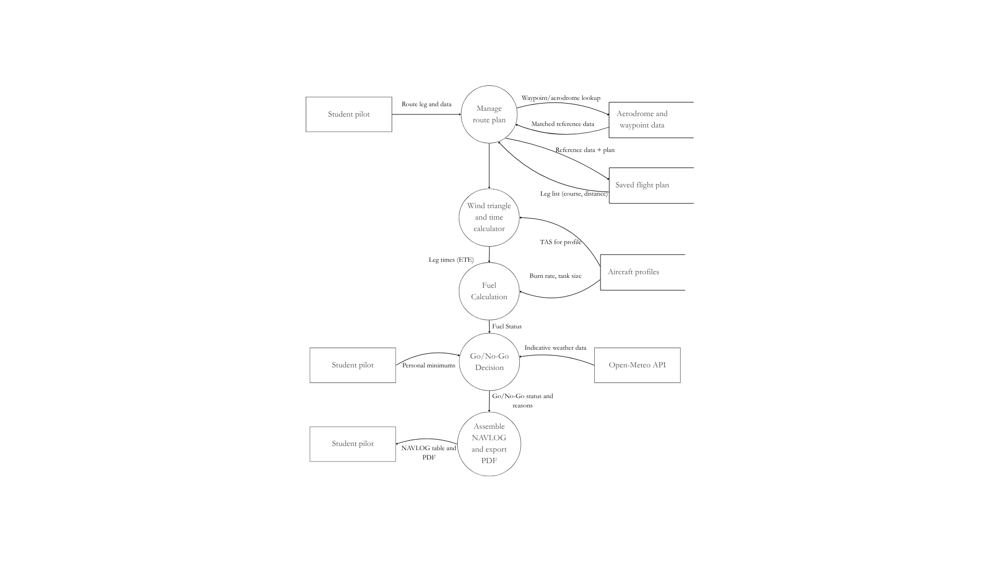

# Research and Planning

---

## Gantt Chart

## Software Development Approach

I will be utilising the Agile software approach in the completion of this project. Why:

* Ability to adjust timeline. The agile framework will allow me to adjust how much time and progress I make depending on my schedule with school
* This allows me to work on parts/functions in the code throughout the duration of the task and makes it such that I do not have to follow a strict order allowing for better motivation as well as better quality of product
* The agile structure will also allow me to recieve feedback from my client more frequently

## Social and Ethical Issues with Program

Ethical Issues
* Ensure that any code or inspiration utilised is properly cited and credits are given
    * Will require a bibliography with all of my sources properly referenced (APA)
* Ensure that an accessible and useable UI is utilised. (DO not use manipulative UI)
    * This will require a decent amount of time to work on the front-end of the program to make sure that everything is sized properly such that no issues occur regarding the UI no matter what device is being utilised
* Ensure that PWA is secure enough to prevent XSS and phishing attacks
    * Need to use data sanitisation properly to ensure that this is prevented. 
    * A workaround may be required as some data that is required by the user may need to include some special characters used commonly for attacks

Social Issues
* Ensure that all major browsers are accounted for and have ability to access the app
    * Need to ensure that this is all accessible wiht all features included from any of the major browsers. Since a lot of these browsers may have differences in the way that things are incorporated, it is vital that any troubleshooting that is necessary is conducted.
* Ensure that sturdy security is established to maintain data security and gain user trust
    * Need to ensure there is sufficient amounts of security protocols to protect flight data and location
* Not all airports/aerodromes can be covered
    * This is an issue since this will make the program inaccessible to many people located outside of Sydney however, due to the constraints that are present regarding time, skill, and hardware available, including all airfields within the Sydney region is quite inclusive given the constraints.

## Communication Plan

Client:
* Will stay in touch with the client via messaging software such as Instagram
* We may also utilise emails to communicate and send prototypes of software

Teachers:
* Can stay in touch via email

Issues that may occur in communication include:
* When working with the client, our time schedules may not line up as we all have very different schedules which may make it difficult to ask for and recieve feedback or collaborate effectively. To address this issue, I will provide sufficient time between each line of communication conducted to prevent overwhelming the client with constant feedback requirements.
* Run-through of the PWA during testing when sent to the client may be difficult as written instructions may be misinterpreted especially for a complex program such as this. To combat this issue, a visual/verbal set of instructions may make this more clear for hte client and thus setting up an online meeting would be useful

## Quality Assurance Checklist

|Aspect|About|
|---|---|
|[Functionality](01.Functionality.md)|Checking if the program works as required or stated previously|
|[Usability](02.Usability.md)|Check if the program is user friendly|
|[Performance](03.Performance.md)|Check if the program runs fast and efficiently|
|[Security](04.Security.md)|Check if the program is safe from threats and protects important data|
|[Compatability and Responsiveness](05.Compatability%20and%20Responsiveness.md)|Check if the program works across browsers and devices|
|[Code Quality and Maintainability](06.Code%20Quality%20and%20Maintainability.md)|Check that the code is functional and clean to follow|
|[Testing](07.Testing.md)|Check that everything has been tested|
|[Error Handling and Logging](08.Error%20Handling%20and%20Logging.md)|Check that the code is able to recover from failures and reset easily|
|[Deployment and Version Control](09.Deployment%20and%20Version%20Control.md)|Check that the code is properly managed|

## Data Dictionary

|Variable|Data type|Format for Display|Size in Bytes|Size for Display|Description|Example|Validation|
|---|---|---|---|---|---|---|---|
|routeID|String|XX-NNNN-NNN|||Unique identifier for the saved route/plan|"RT-2026-014"||
|departureAerodrome|String|XXXX|||ICAO code for the departure aerodrome|"YBSK"||
|arrivalAerodrome|String|XXXX|||ICAO code for the arrival aerodrome|"YSCN"||
|legID|Integer|NN|||Sequence number of the leg within the route|1||
|legFromWaypoint|String|XX...XX|||Name of the waypoint/aerodrome starting the leg|"Prospect Reservoir"||
|legToWaypoint|String|XX...XX|||Name of the waypoint/aerodrome finishing the leg|"Warragamba"||
|legDistance|Float|NN.N|||Great-circle distance of the leg in nautical miles|12.4||
|legTrueCourse|Float|NNN.N|||True course of the leg (0-360 degrees)|247.0||
|windDirectionFrom|Float|NNN.N|||Direction the wind is blowing from|260.0||
|windSpeed|Float|NNN.N|||Forecast/entered wind speed in knots|18.0||
|trueAirspeed|Float|NNN.N|||Aircraft true airspeed for selected profile|95.0||
|magneticVariation|Float|NNN.N|||Local magnetic variation|12.5||
|windAngle|Float|NNN.N|||Angle between wind direction and true course|13.0||
|windCorrectionAngle|Float|NNN.N|||Angle to fly off-course to counter drift|2.3||
|trueHeading|Float|NNN.N|||True course adjusted by WCA|249.3||
|magneticHeading|Float|NNN.N|||True heading adjusted by magnetic variation|236.8||
|groundspeed|Float|NNN.N|||Actual speed over the ground for the leg|88.6||
|departureTimeLocal|Time|HH:MM|||Nominated departure time entered by student|"09:15"||
|legTime|Float|NN.N|||Estimated time enroute for one leg|8.4||
|cumulativeEta|Time|HH:MM|||Running estimated time of arrival at each waypoint|"09:23"||
|totalFlightTime|Float|NN.N|||Sum of all leg times for the route|46.0||
|fuelBurnRate|Float|NNN.N|||Cruise fuel consumption for the selected aircraft|24.0||
|tankCapacity|Float|NNN.N|||Usable fuel capacity of the aircraft|144.0||
|taxiFuel|Float|NN.N|||Fixed allowance for start, taxi, and run-up|3.0||
|tripFuel|Float|NNN.N|||Fuel burned across all planned legs|18.4||
|reserveFuel|Float|NN.N|||Reserve fuel; 30 min day VFR or 45 min night/marginal|12.0||
|totalFuelRequired|Float|NNN.N|||taxiFuel + reipFuel + reserveFuel|33.4||
|fuelSufficient|Boolean|True/False|||True if totalFuelCapactiy <= tankCapacity|true||
|aircraftType|String|XXXXX|||Selected trainer aircraft profile|"C172"||
|engineType|String|XX...XX|||Engine category, affects reserve/burn logic|"normally_aspirated"||
|flightCondition|String|XX...XX|||"day_vfr", "night", or "marginal_vfr"|"day_vfr"||
|aerodromeCode|String|XXXX|||Unique key for aerodrome record|"YWOL"||
|aerodromeFrequency|Float|NNN.NN|||CTAF/tower frequency|126.55||
|circuitDirection|String|XXXXX|||"left" or "right" hand circuit|"left"||
|elevationFt|Integer|NNNN|||Aerodrome elevation aabove mean sea level|210||
|restrictionSummary|String|XXX...XXX|||Plain-English airspace/restriction note|"Avoid Sydney Class C Shelf"||
|waypointName|String|XX...XX|||Name of a VFR reporting point/landmark|"Nepean River"||
|waypointLat/waypointLon|Float, Float|NNN.NN, NNN.NN|||Coordinates used to plot the waypoint on the nav page|-33.85, 150.75||
|maxCrosswind|Float|NNN.NN|||Student's personal crosswind limit|12.0||
|minVisibility|Float|NN.NN|||Student's personal visibility limit|8.0||
|maxCloudCover|String|XXXXX|||Acceptable cloud cover|"SCT"||
|minCloudBaseFt|Integer|NNNNN|||Student's minimum acceptable cloud base|2500||
|nightCurrent|Boolean|true or false|||Whether the student is night-current|false||
|weatherWindSpeed|Float|NNN.NN|||Wind speed fetched from Open-Meteo|20.0||
|weatherVisibilityKm|Float|NN.N|||Indicative visibility fetched from Open-Meteo|9.0||
|weatherCloudBaseFt|Integer|NNN.NN|||Indicative cloud base fetched from Open-Meteo|2200||
|goNoGoStatus|String|XXX...XXX|||"Go", "Caution", or "No-Go"|"Caution"||
|reasonList|Array<String>|[XX...XX, XX...XX]|||Reasons contributing to the status|[Cloud base near minimum]||

## Software Model

### Why DFD?

A Level 1 DFD suits this project because it captures data movement through the system's core pipeline which incorporates route input, wind triangle calculation, fuel calculation, Go/No-Go decision, and NAVLOG/PDF export whilst explicitly showing the external entities (student pilot, Open-Meteo API) and data stores (aerodrome/waypoint data, aircraft profiles, saved plans) that the project's "no login, no key, client-side only" design depends on. Unlike a Class Diagram which is too detailed with such a large project, Structure Chart which models code organisation, not the problem being solved, Storyboard captures UI but not data/logic, or Decision Tree as this only fits the Go/No-Go feature, a DFD gives a whole-system overview of what the app does with data, aligning directly with the requirements-analysis section of the plan. Its main limitation is that it deliberately omits sequencing, timing, and control logic which means that it doesn't show that the weather fetch is asynchronous, that audio callouts run on an independent timer, or the specific branching rules behind the Go/No-Go decision, and it says nothing about screen layout or user interaction flow. Despite this, it works best as the system-wide overview diagram, with a supplementary flowchart, decision tree, or storyboard used later to justify individual features in more detail.

##### [Back to Master](/at-3-e-portfolio-vismay-swami-attempt-3/Master_ePortfolio.md)

---

##### Vismay Swami Software Engineering AT3

**Email** · vismay.swami@education.nsw.gov.au