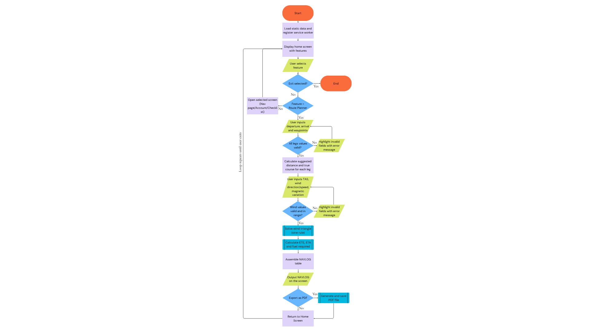

# Producing and Implementing

---

### Logic Flowchart

2. How security is implemented within the code.

3. Include relevant code snippets as part of your explanation.

##### [Back to Master](/at-3-e-portfolio-vismay-swami-attempt-3/Master_ePortfolio.md)

---

##### Vismay Swami Software Engineering AT3

**Email** · vismay.swami@education.nsw.gov.au