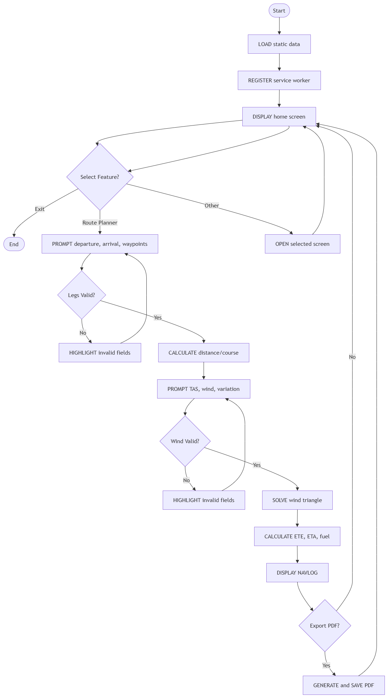
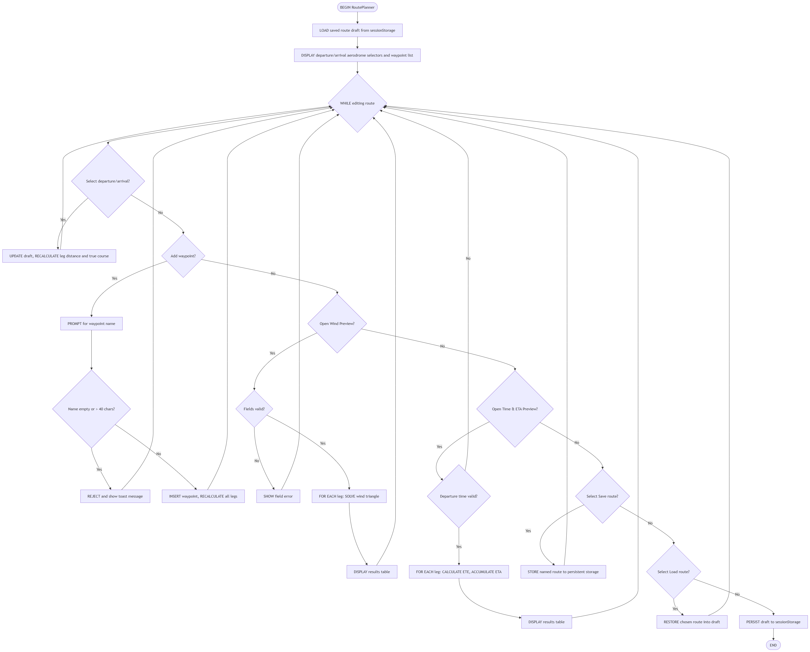
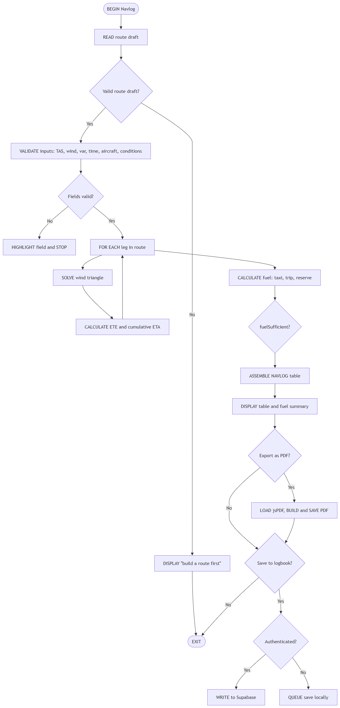
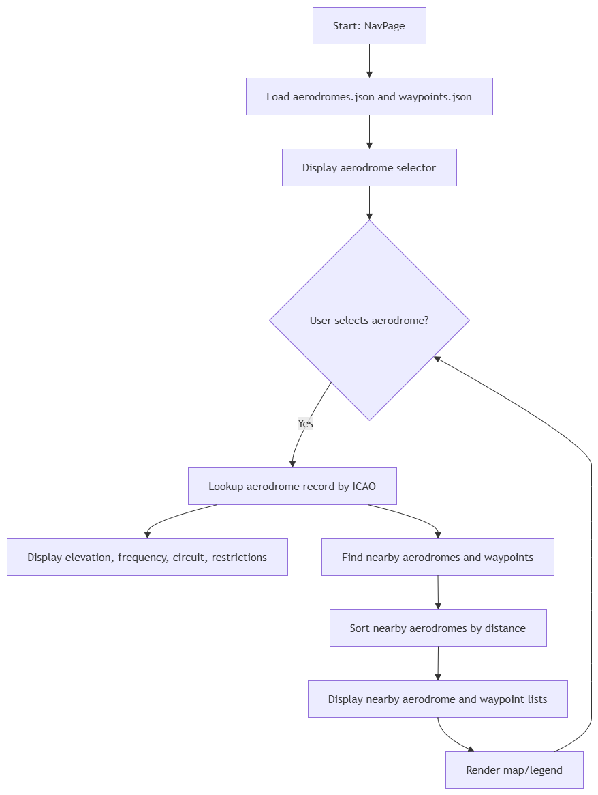
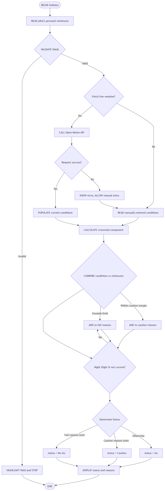
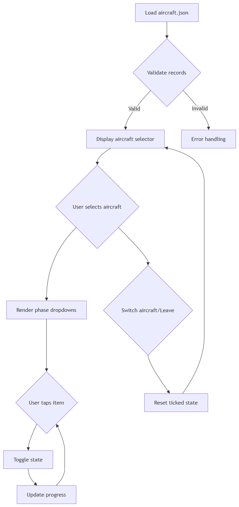
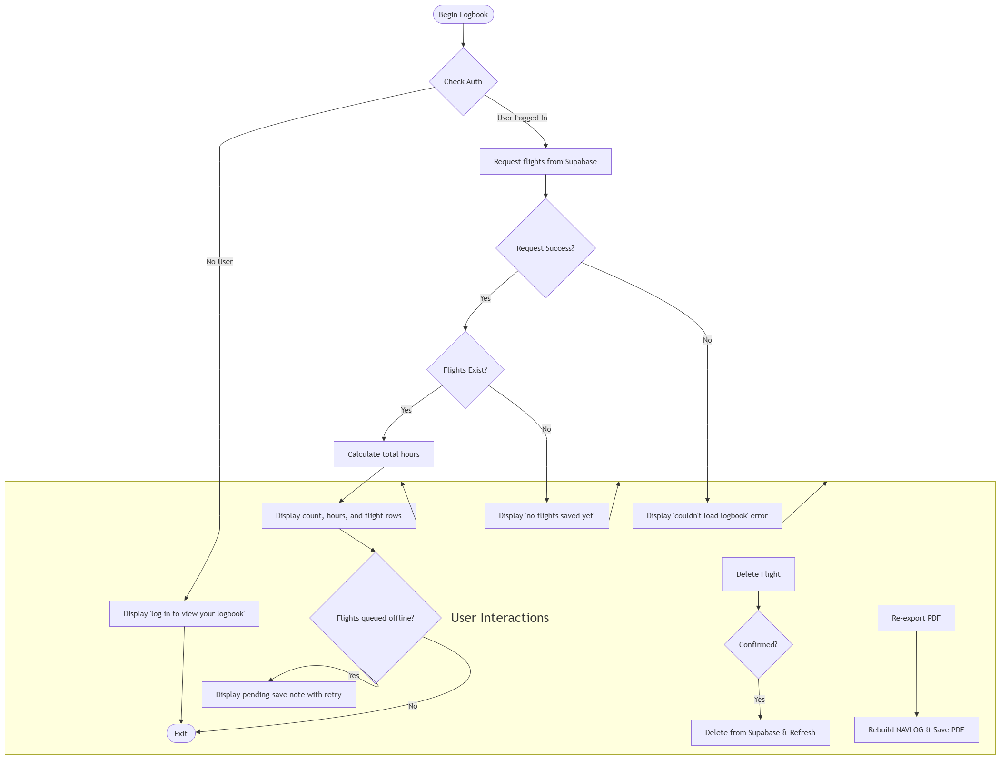

# Producing and Implementing

---

### Logic Flowcharts

#### Main Application Flow



#### Main Application Pseudocode
```
BEGIN
  LOAD static data (aerodromes.json, waypoints.json, aircraft.json)
  REGISTER service worker (enables offline app shell + install prompt)
  DISPLAY home screen with feature cards (Route Planner, NAVLOG, Nav Page,
    Go/No-Go, Checklists, Logbook, Account)

  REPEAT
    WAIT for user to select a feature card OR request exit
    IF exit selected THEN
      BREAK
    ELSE IF feature = "Route Planner" THEN
      REPEAT
        PROMPT user for departure aerodrome, arrival aerodrome, waypoints
        IF any leg's distance/course values are invalid THEN
          HIGHLIGHT invalid fields with an error message
        END IF
      UNTIL all leg values are valid
      CALCULATE suggested distance and true course for each leg

      REPEAT
        PROMPT user for TAS, wind direction/speed, magnetic variation
        IF wind values are invalid or out of range THEN
          HIGHLIGHT invalid fields with an error message
        END IF
      UNTIL wind values are valid

      SOLVE wind triangle (sine rule) for each leg
      CALCULATE ETE, ETA and fuel required
      ASSEMBLE NAVLOG table
      DISPLAY NAVLOG on screen

      IF user selects "Export as PDF" THEN
        GENERATE and SAVE PDF file
      END IF
    ELSE
      OPEN the selected screen (Nav Page / Account / Checklists / Go-No-Go /
        Logbook)
    END IF
    RETURN to home screen
  UNTIL exit selected
END
```
#### Route Planner Flow



#### Route Planner Pseudocode

```
BEGIN RoutePlanner
  LOAD saved route draft from sessionStorage, IF one exists
  DISPLAY departure/arrival aerodrome selectors and waypoint list

  WHILE user is editing the route
    IF user selects departure or arrival aerodrome THEN
      UPDATE draft, RECALCULATE leg distance and true course
    ELSE IF user adds a waypoint THEN
      PROMPT for a waypoint name
      IF name is empty OR longer than 40 characters THEN
        REJECT and show a toast message
      ELSE
        INSERT waypoint into route, RECALCULATE all legs
      END IF
    ELSE IF user opens the Wind Preview panel THEN
      VALIDATE TAS, wind direction, wind speed, magnetic variation
      IF any field invalid THEN
        SHOW field error
      ELSE
        FOR EACH leg: SOLVE wind triangle (heading, WCA, groundspeed)
        DISPLAY results table
      END IF
    ELSE IF user opens the Time & ETA Preview panel THEN
      VALIDATE departure time as 24-hour HH:MM
      IF valid THEN
        FOR EACH leg: CALCULATE ETE from distance/groundspeed,
          ACCUMULATE running ETA
        DISPLAY results table
      END IF
    ELSE IF user selects "Save route" THEN
      STORE named route (name, waypoints) to persistent storage
    ELSE IF user selects "Load route" THEN
      RESTORE the chosen saved route into the draft
    END IF
  END WHILE

  PERSIST draft to sessionStorage so NAVLOG/Nav Page can read it
END
```

#### NAVLOG and PDF Export Flow



##### NAVLOG and PDF Export Pseudocode

```
BEGIN Navlog
  READ route draft (departure, arrival, waypoints, legs)
  IF no valid route draft exists THEN
    DISPLAY "build a route first" message
    EXIT
  END IF

  VALIDATE TAS, wind direction/speed, magnetic variation, departure time,
    aircraft selection, flight condition (day/night/marginal)
  IF any field invalid THEN
    HIGHLIGHT the field and STOP
  END IF

  FOR EACH leg in route
    SOLVE wind triangle -> true heading, magnetic heading, groundspeed
    CALCULATE ETE for the leg, ACCUMULATE cumulative ETA
  END FOR

  CALCULATE trip fuel, taxi fuel, reserve fuel (day/night/marginal rule)
  total required = taxi + trip + reserve
  fuelSufficient = total required <= usable tank capacity

  ASSEMBLE NAVLOG table (leg, course, heading, GS, ETE, ETA, fuel)
  DISPLAY table and fuel summary on screen

  IF user selects "Export as PDF" THEN
    LOAD jsPDF library (lazy, from CDN)
    BUILD PDF document from NAVLOG data
    SAVE PDF file to device
  END IF

  IF user selects "Save to logbook" THEN
    IF user authenticated THEN
      WRITE flight snapshot to Supabase "flights" table
    ELSE
      QUEUE the save locally, retry once back online/logged in
    END IF
  END IF
END
```

#### Nav Page Flow



##### Nav Page Pseudocode
```
BEGIN NavPage
  LOAD aerodromes.json and waypoints.json (once, cached)
  DISPLAY aerodrome selector

  WHEN user selects an aerodrome
    LOOKUP aerodrome record by ICAO code
    DISPLAY elevation, frequency, circuit direction, restriction summary
    FIND nearby aerodromes within a set radius, SORT by distance
    DISPLAY nearby aerodrome list
    FIND waypoints near the selected aerodrome
    DISPLAY nearby waypoint list
    RENDER simple map/legend showing the aerodrome and surrounding points
  END WHEN
END
```

#### Go / No-Go Flow



##### Go / No-Go Pseudocode

```
BEGIN GoNoGo
  READ pilot's personal minimums (max wind, max crosswind, min visibility,
    max cloud cover, night-current flag) from the form
  VALIDATE each minimum field
  IF any invalid THEN
    HIGHLIGHT field and STOP
  END IF

  IF user selects "Fetch live weather" THEN
    CALL Open-Meteo API for the departure aerodrome's coordinates
    IF request fails THEN
      SHOW error, ALLOW manual entry instead
    ELSE
      POPULATE current conditions (wind, visibility, cloud cover) from response
    END IF
  ELSE
    READ manually-entered current conditions
  END IF

  CALCULATE worst-leg crosswind component from route legs, wind dir/speed
  COMPARE each condition against the matching minimum:
    IF any condition exceeds its limit THEN ADD to fail reasons
    ELSE IF condition is within a caution margin of its limit THEN ADD to caution reasons
  END COMPARE
  IF flight condition = night AND pilot not night-current THEN
    ADD automatic fail reason
  END IF

  IF any fail reason exists THEN status = "No-Go"
  ELSE IF any caution reason exists THEN status = "Caution"
  ELSE status = "Go"
  END IF

  DISPLAY status and the list of reasons
END
```

#### Checklists Flow



##### Checklists Pseudocode

```
BEGIN Checklists
  LOAD aircraft.json, VALIDATE each aircraft record has all required
    checklist phases (pre-start, start, taxi, run-up, takeoff, cruise,
    descent, landing, shutdown)
  DISPLAY aircraft selector

  WHEN user selects an aircraft
    RENDER a dropdown per checklist phase, each containing its items
  END WHEN

  WHEN user taps a checklist item
    TOGGLE its ticked/unticked state
    UPDATE the visible progress for that phase
  END WHEN

  WHEN user switches aircraft or leaves the page
    RESET ticked state for the new aircraft
  END WHEN
END
```

#### Logbook Flow



##### Logbook Pseudocode

```
BEGIN Logbook
  CHECK current authenticated user via Supabase Auth
  IF no user is logged in THEN
    DISPLAY "log in to view your logbook" prompt
    EXIT
  END IF

  REQUEST this pilot's flights from Supabase ("flights" table, filtered by
    pilot_id — enforced again at the database by Row Level Security)
  IF request succeeds AND flights exist THEN
    CALCULATE total hours (sum of flight_time_minutes / 60)
    DISPLAY flight count, total hours, and one row per flight (escaped)
  ELSE IF request succeeds AND no flights exist THEN
    DISPLAY "no flights saved yet" message
  ELSE
    DISPLAY "couldn't load logbook" error
  END IF

  WHEN user selects "Re-export PDF" on a row
    REBUILD the NAVLOG data from the stored route snapshot
    GENERATE and SAVE the PDF again
  END WHEN

  WHEN user selects "Delete" on a row
    CONFIRM with the user
    IF confirmed THEN DELETE that flight from Supabase, REFRESH the list
  END WHEN

  IF flights were queued offline (saved while logged out/offline) THEN
    DISPLAY a pending-save note with a "retry" action
  END IF
END
```
<br>

### How Security Is Implemented Within the Code


1. **Cross-Site Scripting (XSS) prevention through output escaping.**

    Every string that comes from a user (a custom waypoint name, an aircraft type) or from the Supabase database (a saved flight's route or date) is passed through a shared `escapeHtml()` helper before it is ever concatenated into an `innerHTML` string. This converts characters like `<`, `>` and `"` into their harmless HTML-entity equivalents, so a value such as `` typed into a field is rendered as plain, inert text on the screen instead of being parsed and executed as markup. This same function is reused across every module that renders dynamic lists including the Logbook, Checklists, Nav Page and both Route Planner/NAVLOG tables so there is exactly one place that behaviour needs to be trusted and tested, rather than every render function re-implementing its own escaping.

    See: [Security_Snippet_1_Output_Escaping.js](Security_Snippet_1_Output_Escaping.js)

2. **Input validation and sanitisation on every field.**

    Rather than trying to strip bad characters out after the fact, every input field (true course, wind speed/direction, TAS, magnetic variation, departure time, custom waypoint names) is checked against a strict numeric range or regular expression before its value is used in a calculation or accepted into the route draft. A shared `numericFieldCheck()` helper enforces min/max bounds for numeric fields, and a dedicated regular expression (`^([01]\d|2[0-3]):([0-5]\d)$`) enforces a strict 24-hour `HH:MM` shape for the departure time field. Any value that fails is rejected before it reaches the wind-triangle or fuel maths, and the corresponding input is marked `aria-invalid="true"` with a visible error message rather than being silently "cleaned".

    See: [Security_Snippet_2_Input_Validation.js](Security_Snippet_2_Input_Validation.js)

3. **Per-user data isolation with Row Level Security (RLS), not just client-side checks.**

    User authentication and authorisation are handled by Supabase Auth, and the `pilots` and `flights` tables both have PostgreSQL Row Level Security enabled with policies scoped to `auth.uid()`. This means the database itself refuses to return or modify a row unless the currently-authenticated user's id matches the row's owner. Even in the theoretical case of a client-side script being compromised, a request for another pilot's saved flights would be rejected at the database layer, which is a far stronger guarantee than a check written only in `logbook.js`.

    See: [Security_Snippet_3_Row_Level_Security.sql](Security_Snippet_3_Row_Level_Security.sql)

4. **Password hashing and session handling delegated to Supabase Auth.**

    This project never stores, hashes, or compares a password itself. `auth.js` only enforces a client-side password policy (length, upper/lowercase, digit, symbol) so the pilot gets instant feedback, while the actual signup/login/reset calls (`supabase.auth.signUp`, `signInWithPassword`, `updateUser`) are handled entirely by Supabase, which hashes passwords server-side and issues a signed session token. If Supabase's own server-side policy rejects a password that passed the local checklist (e.g. it is on a known leaked-password list), that server-provided reason is shown to the user instead of a generic message.

    See: [Security_Snippet_4_Auth_And_Passwords.js](Security_Snippet_4_Auth_And_Passwords.js)

5. **HTTPS.** As this project is currently run locally/from GitHub Pages rather than a custom server, HTTPS enforcement is provided automatically by GitHub Pages and by Supabase (all `supabase-js` calls are made over `https://*.supabase.co`); there is no plain-HTTP endpoint anywhere in the app for a "force HTTPS" setting to apply to.

---


##### [Back to Master](/at-3-e-portfolio-vismay-swami-attempt-3/Master_ePortfolio.md)

---

##### Vismay Swami Software Engineering AT3

**Email** · vismay.swami@education.nsw.gov.au