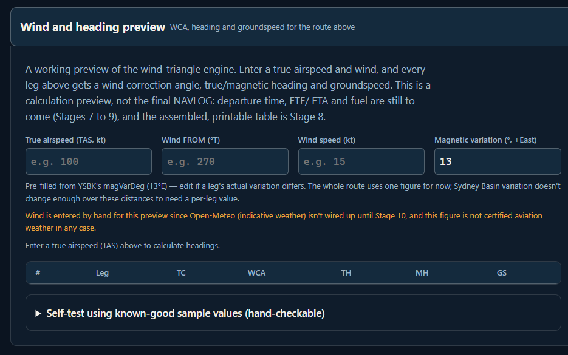
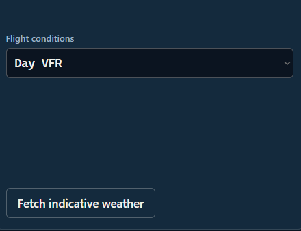
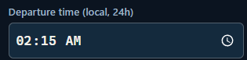
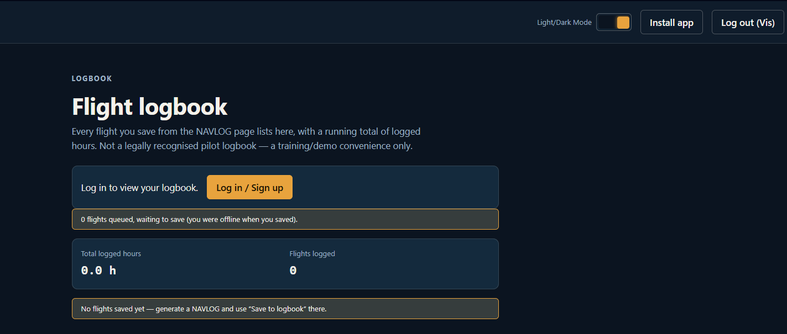
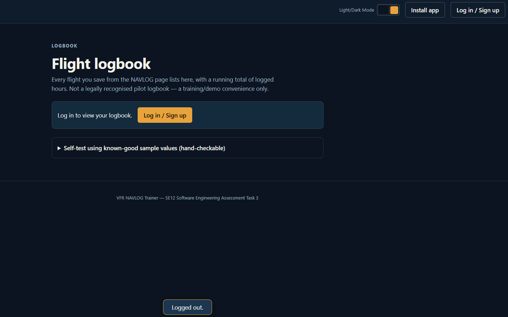

# 4. Evidence of Testing

**Note:** the specific screenshots/recordings below still need to be captured from the live app and dropped into this section (or an `/evidence` subfolder linked from here). This section lists exactly what to capture for each test case in 03.Test Cases.md so the evidence lines up with the claims made there.

 

**Test Case ID:** TC-01 (Route Planner Wind Preview)

 

**Evidence Attachment:** Screenshot of the Wind Preview panel's Self-test list showing all cases passing, and a screenshot of the panel showing it has no "fetch live weather" control (for comparison, a screenshot of the Go/No-Go page which does have one).

Wind Preview Panel:

Go/No-Go Page:

 

 

---

**Test Case ID:** TC-02 (Departure time field)

 

**Evidence Attachment:** Screenshot of the native time picker open on a device/browser set to a 12-hour locale, next to the field's "24-hour" helper/error text, showing the visual mismatch. Optionally, DevTools console screenshot of `document.getElementById("time-eta-departure").value` showing the underlying value is still correct 24-hour `HH:MM`.

 

 

---

**Test Case ID:** TC-03 (Logbook logged-in state)

 

**Evidence Attachment:** Screenshot sequence: (1) logged in, account button showing "Log out (name)", (2) Logbook page still showing the "log in to view your logbook" prompt, (3) after clicking that prompt's button, the account button reverting to "Log in / Sign up" and a "Logged out." toast, demonstrating the sign-out side effect.

1. 
2. 

 

 

---

**Test Case ID:** TC-04 (Go/No-Go decision logic)

 

**Evidence Attachment:** Screenshot of the Go/No-Go Self-test panel reading "8 / 8 self-test cases pass", plus one screenshot each of a manually-entered "Go", "Caution"/"No-Go" (over-limit wind), and "No-Go" (night without currency) result with their listed reasons.

Absent Reasoning:

Reasoning Present for Go:

 

 

---

